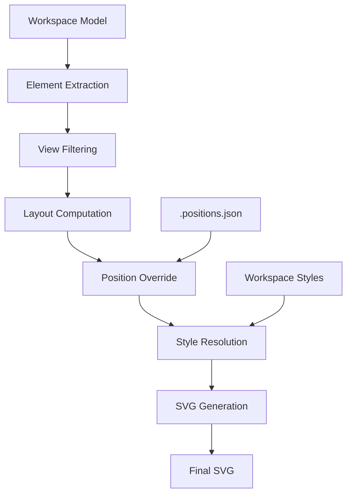

# SVG Rendering Pipeline Implementation

This document provides a comprehensive overview of the SVG rendering system in structurizr-rs, covering the complete pipeline from workspace model to final SVG output.

## Table of Contents

1. [Overview](#overview)
2. [Core Components](#core-components)
3. [Rendering Pipeline](#rendering-pipeline)
4. [Key Data Structures](#key-data-structures)
5. [SVG Generation Process](#svg-generation-process)
6. [Performance Considerations](#performance-considerations)
7. [Extension Points](#extension-points)

## Overview

The SVG rendering system in structurizr-rs is a sophisticated multi-stage pipeline that transforms C4 model elements and relationships into high-quality vector graphics. The system is located primarily in `crates/structurizr-render/src/svg.rs` (3,171 lines) and orchestrates layout algorithms, style resolution, shape rendering, and text positioning.

### Architecture Philosophy

The rendering system follows these principles:

1. **Separation of Concerns**: Layout, styling, and rendering are distinct phases
2. **Incremental Computation**: Only compute what's needed when it's needed
3. **Position Persistence**: Support both auto-layout and manual positioning
4. **Progressive Enhancement**: Basic shapes enhance with icons, text, and metadata
5. **Collision Avoidance**: Smart label positioning to prevent overlaps

## Core Components

### Main Module Structure

```rust
// crates/structurizr-render/src/svg.rs
pub struct SvgRenderer {
    width: i32,    // Default: 2000
    height: i32,   // Default: 1500
    theme: Option<String>,
}

pub struct RenderConfig {
    background_color: Option<String>,  // Light/dark mode support
}

struct ContentBounds {
    min_x: f32,
    min_y: f32,
    max_x: f32,
    max_y: f32,
}

struct TextBounds {
    x: f32,
    y: f32,
    width: f32,
    height: f32,
}
```

### Supporting Modules

- `layout.rs`: Grid-based layout with adaptive spacing
- `shapes.rs`: Individual shape rendering functions
- `style_resolver.rs`: Cascading style resolution
- `routing/`: Edge routing strategies (direct, orthogonal, curved)
- `sugiyama/`: Advanced hierarchical layout algorithm
- `positions.rs` (in web crate): Position persistence for drag-and-drop

## Rendering Pipeline

The complete rendering pipeline follows this sequence:



### Phase 1: Element Extraction

Elements are extracted from the workspace model based on view type:

```rust
fn extract_elements_for_view(workspace: &Workspace, view: &dyn ViewTrait) -> Vec<Element> {
    // Filter elements based on view type and inclusion rules
    let mut elements = Vec::new();

    // Apply view-specific logic
    match view.view_type() {
        ViewType::SystemContext => {
            // Include system and external dependencies
        }
        ViewType::Container => {
            // Include containers within the scoped system
        }
        // ... other view types
    }

    // Apply include/exclude directives
    apply_view_directives(&mut elements, view);

    elements
}
```

### Phase 2: View Filtering

The view's include/exclude directives are strictly enforced:

```rust
// From svg.rs:634-636
if !include_element(&element_view, &view.properties) {
    continue; // Skip excluded elements
}
```

### Phase 3: Layout Computation

Layout uses the Sugiyama algorithm for hierarchical graphs:

```rust
// svg.rs:1234-1245
let layout_result = GridLayout::default().layout_sugiyama(
    nodes.clone(),
    edges.clone(),
    direction,
);

// Apply computed positions
for layout_node in layout_result.nodes {
    if let Some(node) = nodes.iter_mut().find(|n| n.id == layout_node.id) {
        node.x = layout_node.x;
        node.y = layout_node.y;
    }
}
```

### Phase 4: Position Override

Explicit positions from `.positions.json` override computed positions:

```rust
// svg.rs:634-636
let explicit_positions = extract_explicit_positions(&view.properties);
apply_explicit_positions(&mut nodes, &explicit_positions);
```

### Phase 5: Style Resolution

Styles cascade from defaults through tags to element-specific styles:

```rust
fn resolve_element_style(element: &Element, styles: &Styles) -> ResolvedElementStyle {
    // Start with defaults based on element kind
    let mut style = default_style_for_kind(element.kind);

    // Apply tag-based styles
    for tag in &element.tags {
        if let Some(tag_style) = styles.elements.get(tag) {
            style.merge(tag_style);
        }
    }

    style
}
```

### Phase 6: SVG Generation

The final SVG is assembled with dynamic viewBox:

```rust
fn generate_svg(elements: Vec<RenderNode>, relationships: Vec<RenderEdge>) -> String {
    let mut svg = String::new();
    let bounds = calculate_content_bounds(&elements);

    // Generate header with viewBox
    svg.push_str(&format!(
        r#"<svg viewBox="{} {} {} {}" xmlns="http://www.w3.org/2000/svg">"#,
        bounds.min_x - PADDING,
        bounds.min_y - PADDING,
        bounds.width() + 2 * PADDING,
        bounds.height() + 2 * PADDING
    ));

    // Add definitions (markers, patterns)
    svg.push_str(&generate_defs());

    // Render groups
    for group in extract_groups(&elements) {
        svg.push_str(&render_group(group));
    }

    // Render relationships
    for relationship in &relationships {
        svg.push_str(&render_relationship(relationship));
    }

    // Render elements
    for element in &elements {
        svg.push_str(&render_element(element));
    }

    svg.push_str("</svg>");
    svg
}
```

## Key Data Structures

### RenderNode

Represents an element ready for rendering:

```rust
struct RenderNode {
    id: String,
    name: String,
    element_type: String,
    description: Option<String>,
    x: f32,
    y: f32,
    width: f32,
    height: f32,
    style: ResolvedElementStyle,
    metadata_enabled: bool,
}
```

### RenderEdge

Represents a relationship with routing information:

```rust
struct RenderEdge {
    source: String,
    target: String,
    description: Option<String>,
    technology: Option<String>,
    style: ResolvedRelationshipStyle,
    routing: EdgePath,  // Direct, Orthogonal, or Curved
}
```

### EdgePath

Describes how a relationship line is drawn:

```rust
enum EdgePath {
    Direct {
        start: Point,
        end: Point
    },
    Orthogonal {
        waypoints: Vec<Point>
    },
    Curved {
        start: Point,
        control1: Point,
        control2: Option<Point>,
        end: Point
    },
}
```

## SVG Generation Process

### Element Structure

Each element generates a group with nested SVG elements:

```xml
<g class="draggable-element" data-element-id="uuid-123">
    <!-- Shape (background) -->
    <rect x="100" y="200" width="400" height="250"
          fill="#1168bd" stroke="#0b4884" stroke-width="2"/>

    <!-- Icon (optional) -->
    <image x="280" y="220" width="40" height="40"
           href="data:image/svg+xml;base64,..."/>

    <!-- Name (bold, primary) -->
    <text x="300" y="260" text-anchor="middle"
          font-family="Arial" font-size="16" font-weight="bold"
          fill="#ffffff">System Name</text>

    <!-- Type metadata (optional) -->
    <text x="300" y="278" text-anchor="middle"
          font-family="Arial" font-size="11"
          fill="#ffffff">[Software System]</text>

    <!-- Technology (optional) -->
    <text x="300" y="294" text-anchor="middle"
          font-family="Arial" font-size="14"
          fill="#ffffff">[Java]</text>

    <!-- Description (wrapped) -->
    <text x="300" y="320" text-anchor="middle"
          font-family="Arial" font-size="13" fill="#ffffff">
        <tspan x="300" dy="0">This is the first line of the</tspan>
        <tspan x="300" dy="16">description that has been wrapped</tspan>
        <tspan x="300" dy="16">to fit within the element bounds</tspan>
    </text>
</g>
```

### Relationship Rendering

Relationships use paths with markers and labels:

```xml
<!-- Relationship line -->
<path d="M 100 200 L 500 400"
      stroke="#707070" stroke-width="2"
      fill="none" marker-end="url(#arrow-707070)"
      class="relationship-line outbound"/>

<!-- Relationship label (positioned to avoid collisions) -->
<g class="relationship-label">
    <rect x="290" y="285" width="80" height="30"
          fill="white" opacity="0.9"/>
    <text x="330" y="300" text-anchor="middle"
          font-family="Arial" font-size="12" fill="#707070">
        Uses
    </text>
    <text x="330" y="312" text-anchor="middle"
          font-family="Arial" font-size="11" fill="#707070">
        [HTTPS]
    </text>
</g>
```

### Arrow Markers

Dynamic markers are generated per color:

```xml
<defs>
    <marker id="arrow-707070" markerWidth="10" markerHeight="10"
            refX="9" refY="5" orient="auto">
        <polygon points="0,0 10,5 0,10" fill="#707070"/>
    </marker>

    <!-- Bold variant for outbound relationships -->
    <marker id="arrow-707070-bold" markerWidth="15" markerHeight="15"
            refX="13.5" refY="7.5" orient="auto">
        <polygon points="0,0 15,7.5 0,15" fill="#707070"/>
    </marker>
</defs>
```

## Performance Considerations

### Optimization Strategies

1. **Lazy Computation**: Only compute layout for visible elements
2. **Position Caching**: Reuse positions from `.positions.json`
3. **Style Deduplication**: Generate shared markers once in `<defs>`
4. **Bounds Tracking**: Incremental bounds calculation during rendering
5. **String Building**: Use `String::with_capacity()` for known sizes

### Memory Management

```rust
// Pre-allocate string capacity
let mut svg = String::with_capacity(estimated_size);

// Reuse collections
let mut text_bounds: Vec<TextBounds> = Vec::with_capacity(relationships.len());

// Clear and reuse rather than reallocate
bounds.clear();
bounds.extend(new_bounds);
```

### Complexity Analysis

- **Layout**: O(V² × iterations) for Sugiyama crossing minimization
- **Label Positioning**: O(R × L × P) where R=relationships, L=labels, P=positions tried
- **Style Resolution**: O(E × T) where E=elements, T=average tags per element
- **SVG Generation**: O(E + R) linear in elements and relationships

## Extension Points

### Adding New Shapes

1. Implement render function in `shapes.rs`:

```rust
pub fn render_new_shape(bounds: &Bounds, style: &ElementStyle) -> String {
    format!(
        r##"<path d="..." fill="{}" stroke="{}" stroke-width="{}"/>"##,
        style.background.as_deref().unwrap_or("#ffffff"),
        style.stroke.as_deref().unwrap_or("#000000"),
        style.stroke_width.unwrap_or(2.0)
    )
}
```

2. Add to shape dispatcher in `svg.rs`:

```rust
match shape {
    Shape::NewShape => shapes::render_new_shape(&bounds, &style),
    // ... other shapes
}
```

### Adding New Routing Strategies

1. Implement router in `routing/` module:

```rust
pub struct NewRouter;

impl NewRouter {
    pub fn route(source: &Bounds, target: &Bounds) -> EdgePath {
        // Compute path
        EdgePath::Direct { start, end }
    }
}
```

2. Add to routing dispatcher:

```rust
match routing_style {
    RoutingStyle::New => NewRouter::route(source, target),
    // ... other routing styles
}
```

### Custom Style Properties

1. Extend `ResolvedElementStyle`:

```rust
pub struct ResolvedElementStyle {
    // ... existing fields
    pub custom_property: Option<String>,
}
```

2. Update style resolver to handle new property:

```rust
if let Some(custom) = element_style.custom_property {
    resolved.custom_property = Some(custom);
}
```

3. Use in rendering:

```rust
if let Some(custom) = style.custom_property {
    svg.push_str(&format!(r#" data-custom="{}""#, custom));
}
```

## Related Documentation

- [Layout Algorithms](layout-algorithms.md) - Details on Grid, Adaptive, and Sugiyama layouts
- [Style System](style-system.md) - Cascading styles and theming
- [Shape Rendering](shape-rendering.md) - Individual shape implementations
- [Edge Routing](edge-routing.md) - Relationship line routing strategies
- [Text Handling](text-handling.md) - Label positioning and collision detection
- [Coordinate Systems](coordinate-systems.md) - Positioning and transformations
- [Drag-and-Drop Implementation](drag-drop-implementation.md) - Interactive positioning