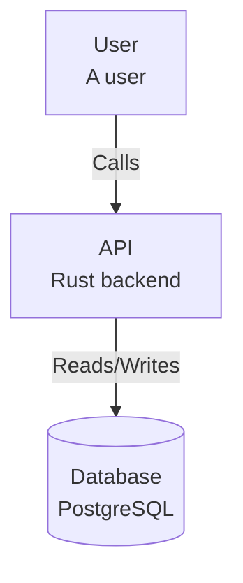

# ADR 006: Export Format Support

## Status

Accepted

## Context

Users need to export their architecture models to various formats for:

1. Integration with other documentation tools
2. Version control and diff-friendly formats
3. Embedding in wikis and documents
4. Generating images for presentations

Several export formats were considered:

1. **JSON** - Structurizr workspace format
2. **PlantUML** - C4-PlantUML syntax
3. **Mermaid** - Markdown-friendly diagrams
4. **GraphML** - Graph exchange format
5. **DOT** - Graphviz format

## Decision

We chose to support three primary export formats:

1. **JSON** - For Structurizr ecosystem compatibility
2. **PlantUML** - For documentation and image generation
3. **Mermaid** - For Markdown/GitHub integration

### Format Comparison

| Format | Use Case | Pros | Cons |
|--------|----------|------|------|
| JSON | Tool interop | Complete data, standard | Not human-readable |
| PlantUML | Docs, images | C4 support, PNG/SVG | External tool needed |
| Mermaid | Markdown | Native GitHub, inline | Limited C4 support |

## Consequences

### Positive

- **Interoperability**: Works with Structurizr cloud/on-premise
- **Documentation**: Multiple output options
- **Version control**: Text-based diffs
- **Flexibility**: Choose best format per use case

### Negative

- **Maintenance**: Multiple exporters to maintain
- **Feature parity**: Not all features in all formats
- **External tools**: PlantUML needs server/jar

### Neutral

- Standard formats, well-documented
- Community-driven format evolution

## Implementation Details

### JSON Export

Direct serialization of workspace:

```rust
pub fn export_json(workspace: &Workspace) -> Result<String> {
    serde_json::to_string_pretty(workspace)
        .map_err(Error::Serialization)
}
```

Output structure matches Structurizr API format:

```json
{
  "name": "System",
  "model": {
    "people": [...],
    "softwareSystems": [...]
  },
  "views": {...}
}
```

### PlantUML Export

Uses C4-PlantUML library macros:

```rust
pub fn export_plantuml(workspace: &Workspace, view: &str) -> Result<String> {
    let mut output = String::new();

    output.push_str("@startuml\n");
    output.push_str("!include C4_Container.puml\n\n");

    for element in view.elements() {
        output.push_str(&format_element(element));
    }

    for rel in view.relationships() {
        output.push_str(&format_relationship(rel));
    }

    output.push_str("@enduml\n");
    Ok(output)
}

fn format_element(element: &Element) -> String {
    match element.kind() {
        ElementKind::Person =>
            format!("Person({}, \"{}\", \"{}\")\n",
                element.id(), element.name(), element.description()),
        ElementKind::Container =>
            format!("Container({}, \"{}\", \"{}\", \"{}\")\n",
                element.id(), element.name(), element.technology(),
                element.description()),
        // ...
    }
}
```

Output example:

```plantuml
@startuml
!include C4_Container.puml

Person(user, "User", "A user")
Container(api, "API", "Rust", "Backend service")
ContainerDb(db, "Database", "PostgreSQL", "Data storage")

Rel(user, api, "Calls", "HTTPS")
Rel(api, db, "Reads/Writes", "SQL")

@enduml
```

### Mermaid Export

Generates flowchart syntax:

```rust
pub fn export_mermaid(workspace: &Workspace, view: &str) -> Result<String> {
    let mut output = String::new();

    output.push_str("graph TB\n");

    for element in view.elements() {
        output.push_str(&format_node(element));
    }

    for rel in view.relationships() {
        output.push_str(&format_edge(rel));
    }

    Ok(output)
}

fn format_node(element: &Element) -> String {
    let shape = match element.kind() {
        ElementKind::Database => format!("[({}<br/>{})]", element.name(), element.tech()),
        _ => format!("[{}<br/>{}]", element.name(), element.description()),
    };
    format!("    {}{})\n", element.id(), shape)
}
```

Output example:



## CLI Usage

```bash
# Export entire workspace to JSON
structurizr export -w workspace.dsl -f json > workspace.json

# Export specific view to PlantUML
structurizr export -w workspace.dsl -f plantuml -v Container > container.puml

# Export to Mermaid for README
structurizr export -w workspace.dsl -f mermaid -v Context > context.md
```

## Alternatives Considered

### GraphML

**Pros**: Standard graph format, tool support
**Cons**: No C4 semantics, verbose XML

### DOT (Graphviz)

**Pros**: Excellent layout engine
**Cons**: Requires external tool, limited styling

### Custom Format

**Pros**: Full control
**Cons**: No ecosystem, learning curve

## Future Considerations

- SVG with embedded metadata
- HTML export with interactive features
- PowerPoint/Keynote export
- Draw.io format

## References

- [Structurizr JSON Schema](https://docs.structurizr.com/json)
- [C4-PlantUML](https://github.com/plantuml-stdlib/C4-PlantUML)
- [Mermaid Documentation](https://mermaid.js.org/syntax/flowchart.html)
