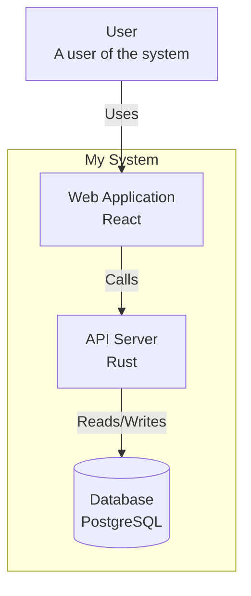

# structurizr-export Crate

The `structurizr-export` crate provides functionality to export architecture workspaces to various formats for integration with other tools and documentation systems.

## Module Overview

```
structurizr-export/
├── src/
│   ├── lib.rs          # Public API
│   ├── json.rs         # Structurizr JSON format
│   ├── plantuml.rs     # PlantUML C4 export
│   └── mermaid.rs      # Mermaid flowchart export
```

## Supported Formats

| Format | Description | Use Case |
|--------|-------------|----------|
| JSON | Structurizr workspace format | Interoperability with Structurizr tools |
| PlantUML | C4-PlantUML syntax | Documentation, image generation |
| Mermaid | Mermaid flowchart syntax | Markdown documentation, GitHub |

## JSON Export

The JSON exporter produces output compatible with the Structurizr API format:

```rust
pub fn export_json(workspace: &Workspace) -> Result<String> {
    serde_json::to_string_pretty(workspace)
        .map_err(|e| Error::SerializationError(e.to_string()))
}
```

### JSON Structure

```json
{
  "name": "My System",
  "description": "System description",
  "model": {
    "people": [...],
    "softwareSystems": [...],
    "relationships": [...]
  },
  "views": {
    "systemContextViews": [...],
    "containerViews": [...],
    "styles": {...}
  },
  "documentation": {
    "sections": [...],
    "decisions": [...]
  }
}
```

## PlantUML Export

The PlantUML exporter generates C4-PlantUML compatible diagrams:

```rust
pub struct PlantUmlExporter {
    workspace: Workspace,
    options: PlantUmlOptions,
}

pub struct PlantUmlOptions {
    pub include_legend: bool,
    pub include_title: bool,
    pub skin_param: Option<String>,
}

impl PlantUmlExporter {
    pub fn export_view(&self, view_key: &str) -> Result<String> {
        let view = self.find_view(view_key)?;
        let mut output = String::new();

        output.push_str("@startuml\n");
        output.push_str("!include https://raw.githubusercontent.com/...\n");

        // Export elements
        for element in &view.elements {
            output.push_str(&self.export_element(element)?);
        }

        // Export relationships
        for rel in &view.relationships {
            output.push_str(&self.export_relationship(rel)?);
        }

        output.push_str("@enduml\n");
        Ok(output)
    }
}
```

### PlantUML Output Example

```plantuml
@startuml
!include https://raw.githubusercontent.com/plantuml-stdlib/C4-PlantUML/master/C4_Container.puml

title Container Diagram for My System

Person(user, "User", "A user of the system")

System_Boundary(system, "My System") {
    Container(webapp, "Web Application", "React", "User interface")
    Container(api, "API Server", "Rust", "Business logic")
    ContainerDb(db, "Database", "PostgreSQL", "Data storage")
}

Rel(user, webapp, "Uses", "HTTPS")
Rel(webapp, api, "Calls", "REST/JSON")
Rel(api, db, "Reads/Writes", "SQL")

@enduml
```

### Element Mapping

| C4 Element | PlantUML Macro |
|------------|----------------|
| Person | `Person(id, name, desc)` |
| Software System | `System(id, name, desc)` |
| Container | `Container(id, name, tech, desc)` |
| Container (DB) | `ContainerDb(id, name, tech, desc)` |
| Component | `Component(id, name, tech, desc)` |

## Mermaid Export

The Mermaid exporter generates flowchart syntax for Markdown embedding:

```rust
pub struct MermaidExporter {
    workspace: Workspace,
    options: MermaidOptions,
}

pub struct MermaidOptions {
    pub direction: MermaidDirection,
    pub theme: Option<String>,
}

pub enum MermaidDirection {
    TopToBottom,  // TB
    BottomToTop,  // BT
    LeftToRight,  // LR
    RightToLeft,  // RL
}

impl MermaidExporter {
    pub fn export_view(&self, view_key: &str) -> Result<String> {
        let view = self.find_view(view_key)?;
        let mut output = String::new();

        let direction = match self.options.direction {
            MermaidDirection::TopToBottom => "TB",
            MermaidDirection::LeftToRight => "LR",
            // ...
        };

        output.push_str(&format!("graph {}\n", direction));

        // Export elements
        for element in &view.elements {
            output.push_str(&self.export_element(element)?);
        }

        // Export relationships
        for rel in &view.relationships {
            output.push_str(&self.export_relationship(rel)?);
        }

        Ok(output)
    }
}
```

### Mermaid Output Example



### Shape Mapping

| C4 Shape | Mermaid Shape |
|----------|---------------|
| Box | `[text]` |
| Rounded | `(text)` |
| Cylinder | `[(text)]` |
| Circle | `((text))` |
| Hexagon | `{{text}}` |

## CLI Usage

Export from command line:

```bash
# Export to JSON
structurizr export --workspace workspace.dsl --format json > workspace.json

# Export to PlantUML
structurizr export --workspace workspace.dsl --format plantuml --view Container > container.puml

# Export to Mermaid
structurizr export --workspace workspace.dsl --format mermaid --view Context > context.md
```

## Programmatic Usage

```rust
use structurizr_export::{
    export_json,
    PlantUmlExporter, PlantUmlOptions,
    MermaidExporter, MermaidOptions,
};

let workspace = parse(dsl)?;

// JSON export
let json = export_json(&workspace)?;

// PlantUML export
let plantuml = PlantUmlExporter::new(workspace.clone())
    .with_options(PlantUmlOptions {
        include_legend: true,
        include_title: true,
        skin_param: None,
    })
    .export_view("Container")?;

// Mermaid export
let mermaid = MermaidExporter::new(workspace)
    .with_options(MermaidOptions {
        direction: MermaidDirection::TopToBottom,
        theme: Some("dark".to_string()),
    })
    .export_view("Context")?;
```

## Customization

### PlantUML Skin Parameters

```rust
let options = PlantUmlOptions {
    skin_param: Some(r#"
        skinparam backgroundColor #1a1a1a
        skinparam defaultFontColor #ffffff
    "#.to_string()),
    ..Default::default()
};
```

### Mermaid Theme

```rust
let options = MermaidOptions {
    theme: Some("dark".to_string()),
    ..Default::default()
};
```

## Error Handling

```rust
pub enum ExportError {
    ViewNotFound(String),
    ElementNotFound(ElementId),
    SerializationError(String),
    IoError(std::io::Error),
}
```
