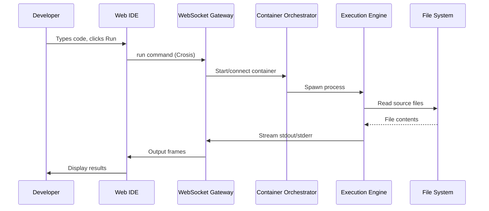
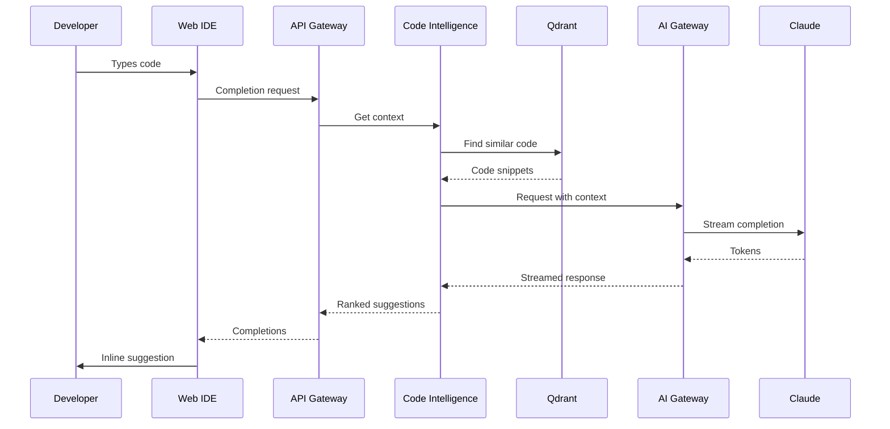

# Architecture Overview

## High-Level Architecture

The Horizon Platform follows a microservices architecture with clear separation between frontend, API gateway, core services, AI services, collaboration services, and infrastructure.

```
┌─────────────────────────────────────────────────────────────────────────┐
│                              FRONTEND TIER                               │
│  ┌──────────────────────────────────────┐  ┌─────────────────────────────┐  │
│  │         Web IDE (React)          │  │    Mobile App (React Native) │  │
│  │  Monaco | Terminal | Preview     │  │    Code View | Deployments   │  │
│  └──────────────────────────────────┘  └─────────────────────────────┘  │
└─────────────────────────────────────────────────────────────────────────┘
                                    │
                    ┌───────────────┴───────────────┐
                    ▼                               ▼
┌─────────────────────────────────┐  ┌────────────────────────────────────┐
│      API GATEWAY (Kong)         │  │    WEBSOCKET GATEWAY (Go/Crosis)   │
│  Rate Limiting | Auth | Routing │  │  Channels | Protobuf | Reconnect   │
└─────────────────────────────────┘  └────────────────────────────────────┘
                    │                               │
        ┌───────────┴───────────┐       ┌──────────┴──────────┐
        ▼                       ▼       ▼                      ▼
┌───────────────┐  ┌───────────────┐  ┌───────────────┐  ┌───────────────┐
│   Workspace   │  │  Deployment   │  │   Container   │  │ Collaboration │
│   Service     │  │  Orchestrator │  │  Orchestrator │  │    Engine     │
└───────────────┘  └───────────────┘  └───────────────┘  └───────────────┘
        │                   │                   │                │
        │         ┌─────────┴─────────┐         │                │
        ▼         ▼                   ▼         ▼                ▼
┌───────────────┐  ┌───────────────┐  ┌───────────────┐  ┌───────────────┐
│  Nix Env      │  │   Execution   │  │  File System  │  │   LSP Hub     │
│  Service      │  │   Engine      │  │   Service     │  │               │
└───────────────┘  └───────────────┘  └───────────────┘  └───────────────┘
                                              │
┌─────────────────────────────────────────────┴───────────────────────────┐
│                            AI SERVICES TIER                              │
│  ┌───────────────┐  ┌───────────────────┐  ┌──────────────────────────┐ │
│  │  AI Gateway   │  │ AI Agent Orchestr │  │ Code Intelligence Service│ │
│  │ (Claude SDK)  │  │ (Claude Agent SDK)│  │    (Embeddings/RAG)      │ │
│  └───────────────┘  └───────────────────┘  └──────────────────────────┘ │
└─────────────────────────────────────────────────────────────────────────┘
                                    │
┌─────────────────────────────────────────────────────────────────────────┐
│                          DATA & INFRASTRUCTURE                           │
│  ┌──────────┐ ┌──────────┐ ┌──────────┐ ┌──────────┐ ┌───────────────┐  │
│  │PostgreSQL│ │  Redis   │ │  MinIO   │ │ClickHouse│ │    Qdrant     │  │
│  │(Metadata)│ │ (Cache)  │ │(Storage) │ │(Analytics)│ │  (Vectors)    │  │
│  └──────────┘ └──────────┘ └──────────┘ └──────────┘ └───────────────┘  │
│  ┌────────────────────────────────┐  ┌────────────────────────────────┐ │
│  │   NATS JetStream               │  │  Monitoring                    │ │
│  │   (Events/KV/Objects)          │  │  (Prometheus/Grafana/Jaeger)   │ │
│  └────────────────────────────────┘  └────────────────────────────────┘ │
└─────────────────────────────────────────────────────────────────────────┘
```

## System Boundaries

### User-Facing Layer
- **Web IDE**: Primary interface for development
- **Mobile App**: Code review and deployment monitoring
- **API Gateway**: REST API entry point
- **WebSocket Gateway**: Real-time bidirectional communication

### Core Services Layer
- **Workspace Service**: Workspace lifecycle and metadata
- **Container Orchestrator**: Container provisioning and management
- **File System Service**: Virtual file system with sync
- **Execution Engine**: Process management and I/O streaming
- **LSP Hub**: Language server protocol proxy

### AI Services Layer
- **AI Gateway**: AI request routing and streaming (FastAPI)
- **AI Agent Orchestrator**: Multi-agent task coordination (Claude Code Agent SDK)
- **Code Intelligence Service**: Embeddings and context building (Qdrant)

### Collaboration Layer
- **Collaboration Engine**: CRDT-based real-time editing
- **Messaging Service**: In-IDE communication

### Deployment Layer
- **Deployment Orchestrator**: Application deployments
- **Domain Manager**: DNS and SSL management

### Infrastructure Layer
- **Messaging Platform**: NATS JetStream for event streaming, pub/sub, and real-time state (see [ADR-018](../adrs/018_NATS_Messaging_Platform.md))
- **Cache Layer**: Redis for application caching
- **Databases**: PostgreSQL, ClickHouse, Qdrant
- **Object Storage**: MinIO (S3-compatible)
- **Monitoring**: Prometheus, Grafana, Jaeger

## Technology Stack

### Frontend
| Component | Technology | Purpose |
|-----------|------------|---------|
| Web Framework | React 18 | UI components |
| Language | TypeScript | Type safety |
| Code Editor | Monaco Editor | VS Code editing |
| Terminal | xterm.js | Terminal emulation |
| State Management | Zustand | Client state |
| Real-time | WebSocket + Crosis | Bidirectional comm |
| Collaboration | Yjs | CRDT sync |
| Build | Vite | Fast bundling |

### Backend Services
| Service | Language | Framework |
|---------|----------|-----------|
| API Gateway | - | Kong |
| WebSocket Gateway | Go | Custom |
| Workspace Service | Go | Fiber |
| Container Orchestrator | Go | client-go |
| File System Service | Rust | Tokio |
| Execution Engine | Go | Custom |
| LSP Hub | TypeScript | Node.js |
| AI Gateway | Python | FastAPI |
| AI Agent Orchestrator | Python | Claude Code Agent SDK |
| Collaboration Engine | Rust | Actix |

### Runtime Infrastructure
| Component | Technology | Purpose |
|-----------|------------|---------|
| Container Runtime | gVisor | Secure sandboxing |
| Orchestration | Kubernetes | Container management |
| Environment | Nix | Package management |
| Ingress | NGINX | Traffic routing |
| Service Mesh | Istio | mTLS, observability |

### Data Stores
| Store | Technology | Use Case |
|-------|------------|----------|
| Metadata | PostgreSQL 15 | Users, workspaces |
| Cache | Redis 7 Cluster | Application caching |
| Files | MinIO | Workspace files (S3-compatible) |
| Analytics | ClickHouse | Usage metrics |
| Vectors | Qdrant | Code embeddings |
| Messaging | NATS JetStream | Event streaming, presence, CRDT snapshots |
| Search | Elasticsearch | Code search |

### Authentication
| Component | Technology | Purpose |
|-----------|------------|---------|
| Identity Provider | Keycloak | OAuth 2.0, OIDC, SSO |
| User Federation | LDAP/AD | Enterprise integration |
| MFA | TOTP/WebAuthn | Multi-factor authentication |

## Component Interactions

### Code Execution Flow



### AI Completion Flow



## Data Architecture

### Workspace Storage Model

```
workspace/
├── .horizon.toml            # Workspace configuration
├── horizon.nix              # Nix environment
├── .env                     # Environment variables (encrypted)
├── src/                     # Source code
│   └── ...
├── .git/                    # Git repository
└── .cache/                  # Build cache
```

### Database Schema (Simplified)

```sql
-- Users
CREATE TABLE users (
    id UUID PRIMARY KEY,
    email VARCHAR(255) UNIQUE,
    name VARCHAR(255),
    created_at TIMESTAMP
);

-- Workspaces
CREATE TABLE workspaces (
    id UUID PRIMARY KEY,
    owner_id UUID REFERENCES users(id),
    name VARCHAR(255),
    language VARCHAR(50),
    is_public BOOLEAN,
    created_at TIMESTAMP
);

-- Workspace Permissions
CREATE TABLE workspace_permissions (
    workspace_id UUID REFERENCES workspaces(id),
    user_id UUID REFERENCES users(id),
    role VARCHAR(20), -- owner, editor, viewer
    PRIMARY KEY (workspace_id, user_id)
);

-- Deployments
CREATE TABLE deployments (
    id UUID PRIMARY KEY,
    workspace_id UUID REFERENCES workspaces(id),
    type VARCHAR(20), -- autoscale, static, reserved
    url VARCHAR(255),
    status VARCHAR(20),
    created_at TIMESTAMP
);
```

## Scalability Design

### Horizontal Scaling

| Component | Scaling Strategy |
|-----------|------------------|
| API Gateway | Replica count based on RPS |
| WebSocket Gateway | Connection count per pod |
| Workspace Service | CPU/memory utilization |
| Container Orchestrator | Queue depth |
| AI Gateway | Concurrent requests |
| Collaboration Engine | Room count |

### Connection Pooling

- **PostgreSQL**: PgBouncer with transaction pooling
- **Redis**: Redis Cluster with consistent hashing
- **NATS**: JetStream consumer groups with queue semantics

### Caching Strategy

| Data | Cache Layer | TTL |
|------|-------------|-----|
| User sessions | Redis | 24h |
| Workspace metadata | Redis | 1h |
| File content | Local SSD | 10m |
| AI completions | Redis | 5m |
| LSP responses | Memory | 1m |

## Reliability Design

### Failure Domains

1. **Region Failure**: Active-active multi-region
2. **Zone Failure**: Pod anti-affinity across zones
3. **Node Failure**: Kubernetes auto-healing
4. **Pod Failure**: Readiness/liveness probes
5. **Network Partition**: Circuit breakers, retries

### Data Durability

- **PostgreSQL**: Synchronous replication, point-in-time recovery
- **Redis**: AOF persistence, cluster replication
- **MinIO**: Erasure coding, cross-region replication
- **NATS JetStream**: Replication factor 3, file storage with snapshots

## Security Architecture

See [008_Security](008_Security.md) for detailed security documentation.

**Key Security Layers:**
1. **Network**: mTLS, network policies, egress filtering
2. **Container**: gVisor, Seccomp, AppArmor
3. **Application**: JWT auth (Keycloak), RBAC, input validation
4. **Data**: Encryption at rest and in transit
